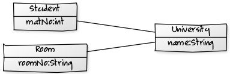

NetworkParser
=============

Framework for serialization from Java objects to Json, XML and Byte.


NetworkParser is a simple framework for serializing complex model structures. 
To do that it transforms a given model to an intermediate model which can be serialized. It also offers lots of filters.

For serialization you are three formats available: Json, XML and Byte. 
For deserialization you can use following formats: Json, XML, Byte and EMF.

The Framework have many other features like:
- Calculator
- Date with holidays
- UML-Layouting with Javascript or Webservice like YUML
- JavaFX Container Classes:
  - for DataBinding
  - Table with Searchfield
  - Form
  - PopupDialog
  - Basic Shell-Class with Writing Errorfiles
- Logicstructure
- SimpleList as universal solution for datamodels

## Current Status ##
- GitLab CI
  - Coveralls [](https://coveralls.io/gitlab/StefanLindel/NetworkParser?branch=feature/gitlab)
  - SonarCloud [](https://sonarcloud.io/summary/new_code?id=StefanLindel_NetworkParser)
- 
- Master
  - travis-ci: [](https://travis-ci.org/fujaba/NetworkParser)
<!--  - Maven: [](http://se.cs.uni-kassel.de/maven/de/uniks/NetworkParser/latest/NetworkParser.jar)-->
  - Coverage: [](https://coveralls.io/github/fujaba/NetworkParser?branch=master)
  - CII Best Practices [](https://bestpractices.coreinfrastructure.org/projects/561)
  - Codacy [](https://www.codacy.com/app/stefan_7/NetworkParser?utm_source=github.com&amp;utm_medium=referral&amp;utm_content=fujaba/NetworkParser&amp;utm_campaign=Badge_Grade)
  - Code Climate [](https://codeclimate.com/github/fujaba/NetworkParser)
  - Coverity Scan: [](https://scan.coverity.com/projects/fujaba-networkparser)
  - Glitter-Chat: [](https://gitter.im/NetworkParser/Lobby?utm_source=badge&utm_medium=badge&utm_campaign=pr-badge&utm_content=badge)
  - Java-Documentation: [](http://javadoc.io/doc/de.uniks/NetworkParser)
  - Maven Central: [](https://maven-badges.herokuapp.com/maven-central/de.uniks/NetworkParser)

- Develop
  - travis-ci: [](https://travis-ci.org/fujaba/NetworkParser)
<!--  - Maven: [](http://se.cs.uni-kassel.de/maven/de/uniks/NetworkParser/latest-SNAPSHOT/NetworkParser-SNAPSHOT.jar)-->
  - Coverage: [](https://coveralls.io/github/fujaba/NetworkParser?branch=develop)
  
[](https://www.openhub.net/p/NetworkParser/)

[](http://www.ej-technologies.com/products/jprofiler/overview.html) optimized

[](https://github.com/ellerbrock/open-source-badges/)

[](http://isitmaintained.com/project/fujaba/networkparser "Average time to resolve an issue")

[](http://isitmaintained.com/project/fujaba/networkparser "Percentage of issues still open")

[](https://sonarcloud.io/dashboard?id=NetworkParser) 

Project Managment

[](https://gitter.im/NetworkParser/Lobby?utm_source=badge&utm_medium=badge&utm_campaign=pr-badge&utm_content=badge)
[](../../releases)


# Getting Started

# Gradle

<pre>
<!-- insert_code_fragment: gradle.repositories -->
repositories {
    mavenCentral()
    maven { url 'https://oss.sonatype.org/content/repositories/snapshots' }
}
<!-- end_code_fragment: -->
</pre>
<pre>
<!-- insert_code_fragment: gradle.dependencies -->
dependencies {
	compile group: "de.uniks", name: "NetworkParser", version: "latest.integration", classifier:"sources18", changing: true
}
<!-- end_code_fragment: -->
</pre>

## Installation
$ git clone https://github.com/fujaba/NetworkParser.git

# Maven artifacts
Maven artifacts are available at:
- http://search.maven.org/#search%7Cga%7C1%7Ca%3A%22NetworkParser%22 - release repository
- https://oss.sonatype.org/content/repositories/snapshots/com/github/fujaba/NetworkParser/ - snaphots repository

# Usage
Simple Example with ClassModelBuilder for build a small class model:
```
ClassModelBuilder mb = new ClassModelBuilder("de.uniks.studyright");
Clazz uni = mb.buildClass("University").withAttribute("name", DataType.STRING);
Clazz student = mb.buildClass("Student").withAttribute("matNo", DataType.INT);

uni.withAssoc(student, "students", Association.MANY, "uni", Association.ONE);
Clazz room = mb.buildClass("Room")
    .withAttribute("roomNo", DataType.STRING);
uni.withAssoc(room, "rooms", Association.MANY, "uni", Association.ONE);
ClassModel model = mb.build();
```
Simple Example with Old ClassModel for build a small class model:
```
ClassModel model = new ClassModel("de.uniks.studyright");
Clazz uni = model.createClazz("University").withAttribute("name", DataType.STRING);
Clazz student = model.createClazz("Student").withAttribute("matNo", DataType.INT);
        
uni.withAssoc(student, "students", Association.MANY, "uni", Association.ONE);
Clazz room = model.createClazz("Room").withAttribute("roomNo", DataType.STRING);
uni.withAssoc(room, "rooms", Association.MANY, "uni", Association.ONE);
model.generate();
```



<!---
Here are a simple Usage of IdMap for serialization and deserialization
{{md  '..src/test/java/de/uniks/networkparser/test/SimpleUsage.java[tag=serialization]'}} 
-->

- [serialization](example.adoc "simple Serialization")

## Maven Snapshot
### pom.xml
```xml
<dependency>
	<groupId>de.uniks</groupId>
	<artifactId>NetworkParser</artifactId>
	<version>4.2.*</version>
</dependency>

<repositories>
	<repository>
		<releases><enabled>false</enabled></releases>
		<snapshots><enabled>true</enabled></snapshots>
		<id>Sonatype Snapshots</id>
		<name>Sonatype Snapshots</name>
		<url>https://oss.sonatype.org/content/repositories/snapshots</url>
	</repository>
</repositories>
```
# Building Jar
| Gradle Command | Description |
|:--:|:--:|
| task | Show task to run |
| clean | Deletes the build directory. |
| buildAll | Build All Jars |
| buildCoreJar | Build Jar with NetworkParser-Core without dependency of JavaFX and Reflection |
| buildFullJar | Build FullJar with Class-Files, Source-Files and JavaDoc |
| buildJavadoc | Build JavaDoc Jar |
| buildSourceJar | Build Jar with class-Files and Source-Files |
| jar | Assembles a jar archive containing the main classes.|

## Links
- [SimpleJsonTest](src/test/java/de/uniks/networkparser/test/SimpleJsonTest.java "Sourcecode SimpleJsonTest.java")
- [House](src/test/java/de/uniks/networkparser/test/model/House.java "Sourcecode House.java")
- [HouseCreator](src/test/java/de/uniks/networkparser/test/model/util/HouseCreator.java "Sourcecode HouseCreator.java")
- The issue list: Head straight to https://github.com/fujaba/NetworkParser/issues for a list of all issues or click `Issues` in the navigation bar on the right.
- See also on Openhub https://www.openhub.net/p/NetworkParser

## Spenden
[](https://www.paypal.com/cgi-bin/webscr?cmd=_s-xclick&hosted_button_id=FSHD59SQ8PR2Y)

# License
NetworkParser is released under an [The MIT License](src/main/resources/Licence.txt). [](https://opensource.org/licenses/mit-license.php)
